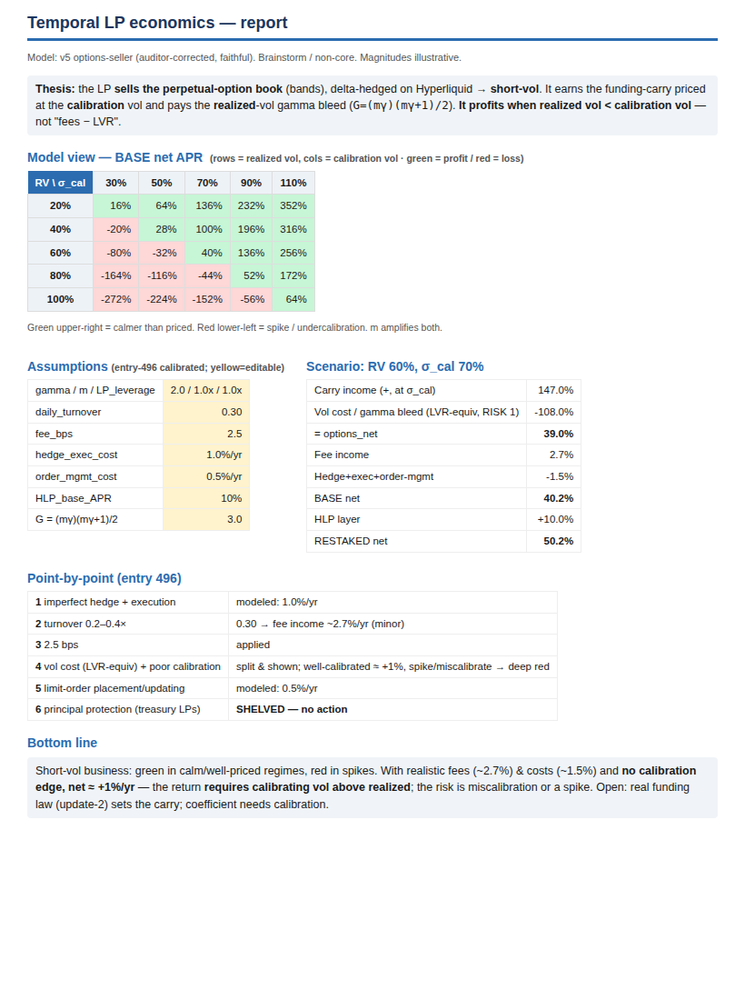

# Temporal LP economics — pointwise report (simulation-backed)

_Concise one-page version: `LP_ECONOMICS_REPORT.pdf` (with model screenshots). Full detail below._

**Model:** `sims/temporal_lp_economics_MODEL_v5_options_seller.xlsx` (faithful options-seller, auditor-corrected).
**Status:** BRAINSTORM / non-core (lives in `sims/`, touches nothing in the engine). Magnitudes ILLUSTRATIVE —
reduced-form sketch, not a backtest.

## Headline: how does a Temporal LP make money (the "AMMs are lossmaking" question)
The LP **sells** the perpetual-option book (the bands) and **delta-hedges on Hyperliquid** → it is a
**short-volatility** position. For a *perpetual*, premium **is** the funding (there is no upfront premium).
So the LP:
- **earns** the funding-carry, priced at the vol the curve is **calibrated** to (`+G·σ_cal²`), and
- **pays** the realized-vol gamma bleed (`−G·RV²`, the LVR-equivalent),
where `G = (m·γ)(m·γ+1)/2`. **Net edge = it profits when realized vol comes in below the calibration vol**
(sold vol rich), plus small fees, plus the HLP yield if HLP-margined. It is *not* "fees − LVR."

## Point-by-point (operator entry 496)
| # | point | answer / what the sim shows |
|---|---|---|
| 1 | imperfect delta hedge + execution costs | **Modeled:** `hedge_exec_cost = 1.0%/yr` (editable estimate). Direct −1.0% to net. |
| 2 | 100% daily turnover unlikely; 0.2–0.4× real | **`daily_turnover = 0.30`.** Fee income drops to **~2.7%/yr** (from ~18% at 1.0×). Fees are now a *minor* contributor — the LP does not live on fees. |
| 3 | 2.5 bps fee | **`fee_bps = 2.5`.** |
| 4 | a vol-equivalent of LVR (risk 1) + poor "calibrated volatility" (risk 2) | **Both shown, split in the scenario tab.** Risk 1 = vol cost / gamma bleed `−G·RV²` (always present). Risk 2 = `σ_cal` set below realized. **Sim:** well-calibrated (`σ_cal=RV`) → net **≈ +1.2%** (just fees − costs); undercalibrate or spike → deep red (`σ_cal=30%,RV=60%` → **−80%**; worst corner `RV=100%,σ_cal=30%` → **−272%**). The whole business rides on calibrating vol right. |
| 5 | constant limit-order placement/updating costs | **Modeled:** `order_mgmt_cost = 0.5%/yr` (editable estimate). |
| 6 | can only an LP's *yield* be at risk, not principal? (treasury LPs) | **SHELVED — no action taken (operator entry 497).** Structuring options recorded in the v5 notes (senior/junior tranche · yield-only bucket · stop-out · tail hedge) for later; **not built, not modeled.** |

## Bottom line from the simulation
- The LP is a **short-vol** business: green when the market is calmer than it priced, red in spikes.
- With realistic fees (~2.7%) and costs (~1.5%) and **no** calibration edge, net is **~+1%/yr — thin**. The real
  return *requires* calibrating vol above realized; the real risk is miscalibration or a vol spike.
- **`m` amplifies both** the carry and the risk (bigger gamma factor `G`).
- **HLP** adds a flat additive yield on the margin (un-levered).

## Load-bearing unknowns (not resolved here)
1. The **carry magnitude** rests on the real **funding law** (update-2, undecided) = the fair carry assumption.
2. The **coefficient/normalization** (`G·book`) needs calibration to the real book (open interest, strike mix).
3. Whether **calibration reliably beats realized vol** (the source of the edge) is an empirical/operator question.
